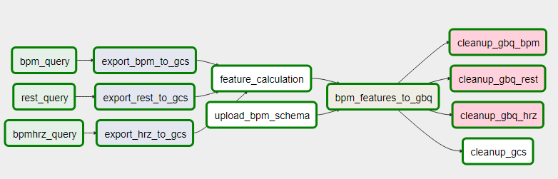
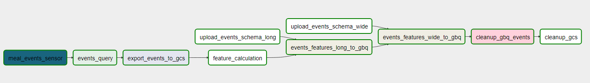

# Fitbit Biomarker Automation
This repo contains the scripts for preparing and preprocessing the Fitbit data. This serves as code documentation.

| By      | Gapuz, Jay Neil      |
| :---    | :---                                                  |                         
| Data Platform   | Bigquery/Airflow/Google Cloud Storage                               |
| Language | Python/SQL                       |

### Table Design V1.0


### Reference

[Heart rate variability with photoplethysmography in 8 million individuals: a cross-sectional study](https://doi.org/10.1016/S2589-7500(20)30246-6)


### A. Heart Rate  
<hr />

#### Output Message Format / Data Dictionary
<table>
    <tr>
        <th>Field</th>
        <th colspan="2">Description</th>
    </tr>
    <tr>
        <td>id</td>
        <td colspan = 2>UUID for specific message/output</td>
    </tr>
    <tr>
        <td>pim_id</td>
        <td colspan = 2>PIM identifier for member/participant</td>
    </tr>
    <tr>
        <td>batch_id</td>
        <td colspan = 2>Batch identifier</td>
    </tr>
    <tr>
        <td>batch_time</td>
        <td colspan = 2>Time the batch was executed/processed</td>
    </tr>
    <tr>
        <td>observation_date</td>
        <td colspan = 2>Observation date of fitbit bpm features</td>
    </tr>
    <tr>
        <td>period_1d /<br>period_7d /<br>period_10d /<br>period_14d</td>
        <td colspan = 2>Fitbit features for the period of 1/7/10/14 day(s)</td>
    </tr>
    <tr>
        <td></td>
        <td>period_start_date</td>
        <td colspan>Start date of the period, observation date - (<b>days</b> - 1)</td>
    </tr>
    <tr>
        <td></td>
        <td>period_end_date</td>
        <td colspan>End date of the period (observation date)</td>
    </tr>
    <tr>
        <td></td>
        <td>earliest_bpm_date</td>
        <td colspan>Earliest BPM date within the specified period</td>
    </tr>
    <tr>
        <td></td>
        <td>latest_bpm_date</td>
        <td colspan>Latest BPM date within the specified period</td>
    </tr>
    <tr>
        <td></td>
        <td>mean_bpm</td>
        <td colspan>Average BPM value (excluding NaNs)</td>
    </tr>
    <tr>
        <td></td>
        <td>sd_bpm</td>
        <td colspan>Standard deviation of BPM values</td>
    </tr>
    <tr>
        <td></td>
        <td>min_bpm</td>
        <td colspan>Minimum bpm value</td>
    </tr>
    <tr>
        <td></td>
        <td>max_bpm</td>
        <td colspan>Maximum bpm value</td>
    </tr>
    <tr>
        <td></td>
        <td>mean_resting_bpm</td>
        <td colspan>Average resting heart rate (excluding NaNs)</td>
    </tr>
    <tr>
        <td></td>
        <td>sd_resting_bpm</td>
        <td colspan>Standard deviation of the resting heart rate</td>
    </tr>
    <tr>
        <td></td>
        <td>min_resting_bpm</td>
        <td colspan>Minimum resting heart rate</td>
    </tr>
    <tr>
        <td></td>
        <td>max_resting_bpm</td>
        <td colspan>Maximum resting heart rate</td>
    </tr>
    <tr>
        <td></td>
        <td>min_bpm_fatburn</td>
        <td colspan>Minimum fatburn heart rate</td>
    </tr>
    <tr>
        <td></td>
        <td>min_bpm_cardio</td>
        <td colspan>Minimum cardio heart rate</td>
    </tr>
    <tr>
        <td></td>
        <td>min_bpm_peak</td>
        <td colspan>Minimum peak heart rate</td>
    </tr>
    <tr>
        <td></td>
        <td>min_bpm_outofrange</td>
        <td colspan>Minimum out of range heart rate</td>
    </tr>    <tr>
        <td></td>
        <td>max_bpm_fatburn</td>
        <td colspan>Maximum fatburn heart rate</td>
    </tr>
    <tr>
        <td></td>
        <td>max_bpm_cardio</td>
        <td colspan>Maximum cardio heart rate</td>
    </tr>
    <tr>
        <td></td>
        <td>max_bpm_peak</td>
        <td colspan>Maximum peak heart rate</td>
    </tr>
    <tr>
        <td></td>
        <td>max_bpm_outofrange</td>
        <td colspan>Maximum out of range heart rate</td>
    </tr>
    <tr>
        <td></td>
        <td>days</td>
        <td colspan>Number of days in period (1/7/10/14 days)</td>
    </tr>
    <tr>
        <td></td>
        <td>count_</td>
        <td colspan>Number of bpm datapoints (excluding NaNs) within the specified period</td>
    </tr>
</table>

#### Sample Payload
```
{
    "ds": "2019-11-01", 
    "pim_id": 52151, 
    "period_1d": {
        "mean_bpm": 71.21755337173839, 
        "sd_bpm": 8.875807609145415, 
        "min_bpm": 53, 
        "max_bpm": 118,
        "count_": 8853, 
        "mean_resting_bpm": 62,
        "sd_resting_bpm": 0, 
        "min_resting_bpm": 62, 
        "max_resting_bpm": 62, 
        "min_bpm_cardio": 111, 
        "max_bpm_cardio": 135, 
        "min_bpm_fatburn": 79, 
        "max_bpm_fatburn": 111, 
        "min_bpm_peak": 135, 
        "max_bpm_peak": 220, 
        "min_bpm_outofrange": null, 
        "max_bpm_outofrange": null, 
        "days": 1, 
        "period_start_date": "2019-11-01",
        "period_end_date": "2019-11-01", 
        "earliest_bpm_date": "2019-11-01 00:00:00", 
        "latest_bpm_date": "2019-11-01 00:00:00"}, 
    "period_7d": {
        "mean_bpm": 75.16832457807087, 
        "sd_bpm": 12.801413511988896, 
        "min_bpm": 49, 
        "max_bpm": 135, 
        "count_": 71576, 
        "mean_resting_bpm": 61.57142857142857,
        "sd_resting_bpm": 1.293626448305345, 
        "min_resting_bpm": 60, 
        "max_resting_bpm": 64, 
        "min_bpm_cardio": 111, 
        "max_bpm_cardio": 135, 
        "min_bpm_fatburn": 79, 
        "max_bpm_fatburn": 111,
        "min_bpm_peak": 135,
        "max_bpm_peak": 220, 
        "min_bpm_outofrange": null,
        "max_bpm_outofrange": null, 
        "days": 7, 
        "period_start_date": "2019-10-26", 
        "period_end_date": "2019-11-01",
        "earliest_bpm_date": "2019-10-26 00:00:00",
        "latest_bpm_date": "2019-11-01 00:00:00"},
    "period_10d": {
        "mean_bpm": 73.48397321787466,
        "sd_bpm": 12.79972973389848, 
        "min_bpm": 49, "max_bpm": 135, 
        "count_": 87073, 
        "mean_resting_bpm": 61.333333333333336,
        "sd_resting_bpm": 1.4142135623730951,
        "min_resting_bpm": 59, 
        "max_resting_bpm": 64, 
        "min_bpm_cardio": 111, 
        "max_bpm_cardio": 135, 
        "min_bpm_fatburn": 79,
        "max_bpm_fatburn": 111, 
        "min_bpm_peak": 135, 
        "max_bpm_peak": 220, 
        "min_bpm_outofrange": null, 
        "max_bpm_outofrange": null, 
        "days": 10, 
        "period_start_date": "2019-10-23", 
        "period_end_date": "2019-11-01", 
        "earliest_bpm_date": "2019-10-24 00:00:00", 
        "latest_bpm_date": "2019-11-01 00:00:00"}, 
    "period_14d": {
        "mean_bpm": 73.48397321787466, 
        "sd_bpm": 12.79972973389848, 
        "min_bpm": 49, "max_bpm": 135,
        "count_": 87073, 
        "mean_resting_bpm": 61.333333333333336, 
        "sd_resting_bpm": 1.4142135623730951, 
        "min_resting_bpm": 59, 
        "max_resting_bpm": 64, 
        "min_bpm_cardio": 111, 
        "max_bpm_cardio": 135, 
        "min_bpm_fatburn": 79,
        "max_bpm_fatburn": 111,
        "min_bpm_peak": 135, 
        "max_bpm_peak": 220, 
        "min_bpm_outofrange": null, 
        "max_bpm_outofrange": null, 
        "days": 14, 
        "period_start_date": "2019-10-19", 
        "period_end_date": "2019-11-01", 
        "earliest_bpm_date": "2019-10-24 00:00:00", 
        "latest_bpm_date": "2019-11-01 00:00:00"},
    "batch_time": "2021-04-23T11:03:37.715715"
}
```

#### Airflow V1.0




### B. Events Features  
<hr />

### Distinct events recorded per day
  Calculate Fitbit bpm features of each event recorded for all pim members. Features are calculated from each recorded daily event.  

Events include:  
+ _sleep stages_   
  + wake    
  + light    
  + deep   
  + rem    
  + awake    
  + asleep    
  + restless    
  + bedtime_start (10 mins before sleep)    
  + bedtime_end (10 mins at the end of sleep event)    
+ _meal events_ 
  + meal_start (10 mins before the start of meal)    
  + meal_return_baseline (10 mins before glucose returned to baseline value)    
  + peak_postprandial (10 mins before the onset of peak postprandial glucose event)  

#### Output Message Format / Data Dictionary

| Field                          | Description                                                                                         |
|--------------------------------|-----------------------------------------------------------------------------------------------------|
| pim_id                         | Participant identifier                                                                              |
| start_time                     | Start time of the event recorded                                                                    |
| end_time                       | End time of the event recorded                                                                      |
| event                          | Name of the event                                                                                   |
| mean_bpm                       | Estimated from average of bpm during the event                                                      |
| sd_bpm                         | Estimated from standard deviation of bpm records during the event                                   |
| max_bpm                        | Maximum recorded bpm value during the event                                                         |
| min_bpm                        | Minimum recorded bpm value during the event                                                         |
| count_                         | Total number of bpm values recorded during the event                                                |

#### Sample Payload
```
{
    "ds": "2021-05-04", 
    "pim_id": "10879",
    "event": "wake",
    "start_time": "2021-05-03 06:38:30", 
    "end_time": "2021-05-03 06:49:59", 
    "mean_bpm": 75.72727272727273, 
    "sd_bpm": 2.596883064924673,
    "min_bpm": 73, 
    "max_bpm": 82,
    "count_": 11, 
    "batch_time": "2021-05-21T16:03:40.986741"
}
```

### Daily events 
Calculate Fitbit bpm features of all similar events recorded daily for all pim members. Features are calculated from all similar daily events. 

#### Output Message Format / Data Dictionary
| Field                          | Description                                                                                         |
|--------------------------------|-----------------------------------------------------------------------------------------------------|
| pim_id                         | Participant identifier                                                                              |
| mean_bpm_(x)                   | Estimated from average of bpm of all the similar events                                             |
| sd_bpm_(x)                     | Estimated from standard deviation of bpm records of all the similar events                          |
| max_bpm_(x)                    | Maximum recorded bpm value of all the similar events                                                |
| min_bpm_(x)                    | Minimum recorded bpm value of all the similar events                                                |
| count_(x)                      | Total number of bpm records for all the similar events                                              |

where _x_ is any of the following sleep/meal events:
+ rem, deep, light, asleep, wake, bedtime_start, bedtime_end, meal_start, peak_postpandrial  

#### Sample Payload
```
{
    "ds": "2021-05-01", 
    "pim_id": "114740", 
    "mean_bpm_wake": 88.06666666666666, 
    "sd_bpm_wake": 8.713718430663736, 
    "min_bpm_wake": 78.0, "max_bpm_wake": 113.0, 
    "count_wake": 30.0, "mean_bpm_light": 80.50746268656717, 
    "sd_bpm_light": 2.7265406489357993, 
    "min_bpm_light": 77.0,
    "max_bpm_light": 94.0,
    "count_light": 201.0, 
    "mean_bpm_deep": 125.83333333333333, 
    "sd_bpm_deep": 17.855126870329304,
    "min_bpm_deep": 86.0,
    "max_bpm_deep": 155.0, 
    "count_deep": 42.0, 
    "mean_bpm_rem": 83.4090909090909,
    "sd_bpm_rem": 3.3050799867791794, 
    "min_bpm_rem": 79.0, 
    "max_bpm_rem": 94.0, 
    "count_rem": 88.0, 
    "mean_bpm_awake": null, 
    "sd_bpm_awake": null, 
    "min_bpm_awake": null, 
    "max_bpm_awake": null, 
    "count_awake": null, 
    "mean_bpm_asleep": null, 
    "sd_bpm_asleep": null, 
    "min_bpm_asleep": null, 
    "max_bpm_asleep": null, 
    "count_asleep": null, 
    "mean_bpm_restless": null, 
    "sd_bpm_restless": null, 
    "min_bpm_restless": null, 
    "max_bpm_restless": null, 
    "count_restless": null, 
    "mean_bpm_bedtime_start": null,
    "sd_bpm_bedtime_start": null, 
    "min_bpm_bedtime_start": null,
    "max_bpm_bedtime_start": null, 
    "count_bedtime_start": null,
    "mean_bpm_bedtime_end": 98.3,
    "sd_bpm_bedtime_end": 6.466065264130884, 
    "min_bpm_bedtime_end": 88.0, 
    "max_bpm_bedtime_end": 106.0, 
    "count_bedtime_end": 10.0, 
    "mean_bpm_meal_start": 72.72727272727273, 
    "sd_bpm_meal_start": 1.2856486930664501, 
    "min_bpm_meal_start": 70.0, 
    "max_bpm_meal_start": 74.0, 
    "count_meal_start": 11.0, 
    "mean_bpm_peak_postprandial_start": null, 
    "sd_bpm_peak_postprandial_start": null,
    "min_bpm_peak_postprandial_start": null, 
    "max_bpm_peak_postprandial_start": null,
    "count_peak_postprandial_start": null,
    "mean_bpm_meal_return_baseline": 76.66666666666667,
    "sd_bpm_meal_return_baseline": 3.4641016151377544, 
    "min_bpm_meal_return_baseline": 73.0,
    "max_bpm_meal_return_baseline": 84.0, 
    "count_meal_return_baseline": 9.0, 
    "batch_time": "2021-05-28T13:39:28.333673"
}
```
#### Airflow V1.0



### C. Heart Rate Variability  
<hr />
Calculate heart rate variability features for all pim members. Features are calculated and derived from the daily bpm values.  

### Distinct events recorded per day

Calculate Fitbit hrv features of each event recorded for all pim members. Features are calculated from each recorded daily event.The event is 1h,3h, 6h and 12h

#### Output Message Format / Data Dictionary

| Field                   | Description                                                                                                                                                                                                            |
|-------------------------|------------------------------------------------------------------------------------------------------------------------------------------------------------------------------------------------------------------------|
| ds                      | running date                                                                                                                                                                                                           |
| pim_id                  | patient id                                                                                                                                                                                                             |
| hrv_type                | event type, 1h, 3h, 6h and 12 h                                                                                                                                                                                        |
| start_time_local        | start datetime of X hour time period. 1 day prior to running date to avoid incomplete data                                                                                                                             |
| end_time_local          | end datetime of X hour time period                                                                                                                                                                                     |
| record_count            | The number of data points within X hours. X=1,3,6 and 12                                                                                                                                                               |
| bpm_mean                | average bpm value within X hours (i.e. between start datetime and end datetime)                                                                                                                                        |
| bpm_stddev              | standard deviation of bpm value within X hour (i.e. between start datetime and end datetime)                                                                                                                           |
| bpm_min                 | min bpm value of standard deviation of bpm value within X hour (i.e. between start datetime and end datetime)                                                                                                          |
| bpm_max                 | max bpm value of standard deviation of bpm value within X hour (i.e. between start datetime and end datetime)                                                                                                          |
| beat_interval_ms_mean   | Average beat interval (i.e. 60000/bpm) within X hour (i.e. between start datetime and end datetime)                                                                                                                    |
| beat_interval_ms_stddev | Standard deviation from beat interval (i.e. 60000/bpm) within X hour (i.e. between start datetime and end datetime)                                                                                                    |
| beat_interval_ms_min    | min beat interval (i.e. 60000/bpm) within X hour (i.e. between start datetime and end datetime)                                                                                                                        |
| beat_interval_ms_max    | max beat interval (i.e. 60000/bpm) within X hour (i.e. between start datetime and end datetime)                                                                                                                        |
| beat_interval_ms_rmssd  | Estimated root mean square of successive differences between normal heartbeats within X hour (i.e. between start datetime and end datetime)                                                                            |
| geom_poincare_sd1       | Poincare index S1 within X hour (i.e. between start datetime and end datetime). The standard deviation measured along the minor axis of the Poincare ellipse is called S1, and is a measure of short term variability. |
| geom_poincare_sd2       | Poincare index S2 within X hour (i.e. between start datetime and end datetime). The standard deviation measured along the major axis of the Poincare ellipse is called S2, and is a measure of long term variability.  |
| tinn                    | Baseline width of the minimum square difference triangular interpolation of the highest peak of the histogram of all NN intervals within X hour (i.e. between start datetime and end datetime)                         |
| rrtri                   | triangular index within X hour (i.e. between start datetime and end datetime)                                                                                                                                          |
| sdann                   | Standard deviation of the averages of NN intervals in all 5 min segments of the entire recording within X hour (i.e. between start datetime and end datetime)                                                          |

#### Sample Payload

```
{
    "ds": "2021-06-13",
    "pim_id": "32937",
    "hrv_type": "1 hour",
    "start_time_local": "2021-06-12T16:00:00",
    "end_time_local": "2021-06-12T17:00:00",
    "record_count": "9",
    "bpm_mean": "125.0",
    "bpm_stddev": "0.0",
    "bpm_min": "125",
    "bpm_max": "125",
    "beat_interval_ms_mean": "480.0",
    "beat_interval_ms_stddev": "0.0",
    "beat_interval_ms_min": "480.0",
    "beat_interval_ms_max": "480.0",
    "beat_interval_ms_rmssd": "1.269841269841282",
    "geom_poincare_sd1": "0.8979133729352952",
    "geom_poincare_sd2": "0.8979133729353066",
    "tinn": null,
    "rrtri": null,
    "sdann": "0.0"
  }
```


### Daily Events

#### Output Message Format / Data Dictionary

| Field                          | Description                                                                                         |
|--------------------------------|-----------------------------------------------------------------------------------------------------|
| pim_id                         | Participant identifier                                                                              |
| mean_rmssd | Estimated from average of root mean square of successive differences between normal heartbeats (daily)  |
| mean_sdrr  | Estimated from average of the standard deviation of all the R-R intervals (daily)  |
| beat_interval_ms_mean | Average beat interval (i.e. 60000/bpm) within 24 hour (i.e. between start datetime and end datetime) |
| beat_interval_ms_stddev | Standard deviation from beat interval (i.e. 60000/bpm) within 24 hour (i.e. between start datetime and end datetime) |
| beat_interval_ms_min | min beat interval (i.e. 60000/bpm) within 24 hour (i.e. between start datetime and end datetime) |
| beat_interval_ms_max | max beat interval (i.e. 60000/bpm) within 24 hour (i.e. between start datetime and end datetime) |
| beat_interval_ms_rmssd | Estimated root mean square of successive differences between normal heartbeats within 24 hour (i.e. between start datetime and end datetime) |
| geom_poincare_sd1 | Poincare index S1 within 24 hour (i.e. between start datetime and end datetime). The standard deviation measured along the minor axis of the Poincare ellipse is called S1, and is a measure of short term variability. |
| geom_poincare_sd2 | Poincare index S1 within 24 hour (i.e. between start datetime and end datetime). The standard deviation measured along the minor axis of the Poincare ellipse is called S2, and is a measure of short term variability. |
| tinn | Baseline width of the minimum square difference triangular interpolation of the highest peak of the histogram of all NN intervals within 24 hour (i.e. between start datetime and end datetime) |
| rrtri | triangular index within 24 hour (i.e. between start datetime and end datetime) |
| sdann | Standard deviation of the averages of NN intervals in all 5 min segments of the entire recording within 24 hour (i.e. between start datetime and end datetime) |

#### Sample Payload

```
  {
    "ds": "2020-02-20",
    "pim_id": "158680",
    "mean_rmssd": "10.402639182480122",
    "mean_sdrr": "23.74441923300968",
    "beat_interval_ms_mean": "653.3343443919276",
    "beat_interval_ms_stddev": "52.15484883425629",
    "beat_interval_ms_min": "468.75",
    "beat_interval_ms_max": "800.0",
    "beat_interval_ms_rmssd": "11.455930321918816",
    "geom_poincare_sd1": "6.147733751724049",
    "eom_poincare_sd2": "42.24632289585758",
    "tinn": "329.2974319268658",
    "rrtri": "4.565980167810832",
    "sdann": "43.60521263835143"
  }
```


#### Airflow V1.0

Only one task using sql. No need to show it here. 

